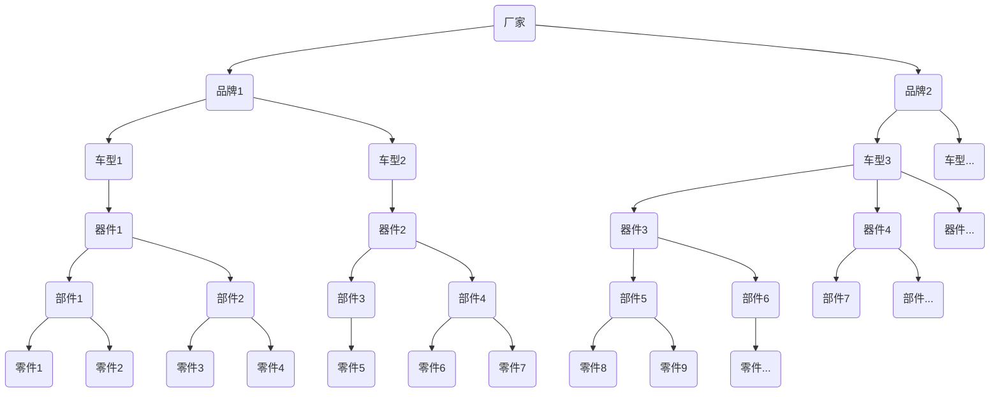
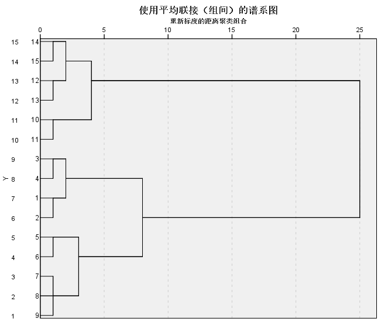
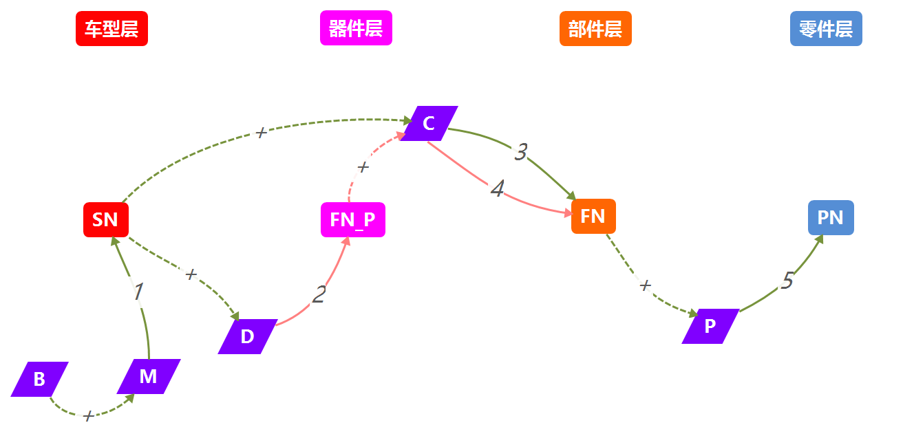
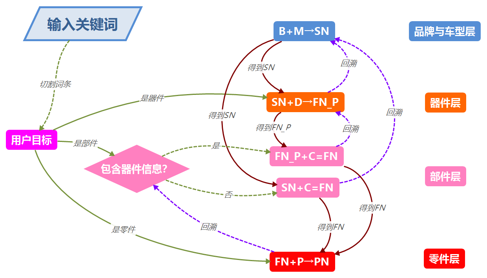

### 基本分类模型：

直观来看，厂家对零件的分类是有层次的树形结构。

零件手册中标识$品牌+车型\rightarrow器件\rightarrow部件\rightarrow零件$四层，分别由$序列号\rightarrow图号首字母\rightarrow图号\rightarrow件号$表示。

树形结构图：

冰柱图：

谱系图：

| 变量       | 符号           |
| ---------- | -------------- |
| 汽车品牌   | $B$            |
| 汽车车型   | $M$            |
| 器件名称   | $D$            |
| 部件名称   | $C$            |
| 零件名称   | $P$            |
| 序列号     | $SN$           |
| 图号       | $FN$           |
| 图号首字母 | $FN_P$         |
| 件号       | $PN$           |
| 工作量     | $W$            |
| 平均值     | $\overline{A}$ |

### 求解

根据该层次的元件数量得出工作量，如零件手册中有200个部件，因此由$序列号\rightarrow图号，W=200$

**厂家查询一个器件，需要品牌+车型+器件信息：**

- 通过品牌+车型，找到序列号    $B+M\rightarrow SN,W未知$
- 通过序列号+器件，找到图号首字母    $SN+D\rightarrow FN_P,W=16$

**厂家查询一个部件，至少需要品牌+车型+部件信息：**

- 通过品牌+车型，找到序列号    $B+M\rightarrow SN,W未知$
- 根据序列号+部件，找到图号    $SN+C\rightarrow FN,W=200$

**厂家查询一个部件，如果拥有品牌+车型+器件+部件的完整信息：**

- 通过品牌+车型，找到序列号    $B+M\rightarrow SN,W未知$
- 通过序列号+器件，找到图号首字母   $SN+D\rightarrow FN_P,W=16$
- 通过图号首字母+部件，找到图号    $FN_P+C\rightarrow FN,\overline{W}=13.1$

**厂家查询一个零件，至少需要品牌+车型+部件+零件信息：**

- 通过品牌+车型，找到序列号    $B+M\rightarrow SN,W未知$
- 通过序列号+部件，找到图号    $SN+C\rightarrow FN,W=200$
- 通过图号+零件，找到件号   $FN+P\rightarrow PN,\overline{W}=16.3$

**厂家查询一个零件，如果拥有品牌+车型+器件+部件+零件的完整信息：**

- 通过品牌+车型，找到序列号    $B+M\rightarrow SN,W未知$
- 通过序列号+器件，找到图号首字母   $SN+D\rightarrow FN_P,W=16$
- 通过图号首字母+部件，找到图号    $FN_P+C\rightarrow FN,\overline{W}=13.1$
- 通过图号+零件，找到件号   $FN+P\rightarrow PN,\overline{W}=16.3$

明显可以看出，如果厂家查找时缺失器件信息，工作量将大大提高，$W_{总}=45.1 \rightarrow W_{总}=216.3$，工作量将是原来的4.8倍。

以上查询方法的步骤主要有

| 序号 | 输入(I)  | 输出(O) | 工作量(W) |
| ---- | -------- | ------- | --------- |
| 1    | B+M      | SN      | /         |
| 2    | SN+D     | $FN_P$  | 16        |
| 3    | SN+C     | FN      | 200       |
| 4    | $FN_P+C$ | FN      | 13.1      |
| 5    | FN+P     | PN      | 16.3      |

##### 查询层次图

### 用户关键词与厂家对零部件分类的对应模型

用户的关键词中包含的信息有多种类型

**如果用户的目标是器件：**

- 品牌+车型+器件(B+M+D)，如**洋马NV94发动机**，$B=洋马,M=NV94,D=发动机$

**如果用户的目标是部件：**

- 品牌+车型+部件（B+M+C），如**LG833变扭器**，$B=LG,M=833,C=变扭器$
- 品牌+车型+器件+部件（B+M+D+C），如**CAT336D液压泵**，$B=CAT,M=336D,D=液压系统，C=主泵$

**如果用户的目标是零件：**

- 品牌+车型+部件+零件(B+M+C+P)，如**小松D155_5推土铲油缸**，$B=小松,M=D155\_5,C=推土铲,P=油缸$
- 品牌+车型+零件（零件中往往包含部件信息）(B+M+C+P)，如**PC56推土铲总成**，$B=PC,T=56,M=推土铲总成$，从P中又可以提取出$C=推土铲$
- B+M+D+C+P的情况则很少出现

用户关键词与厂家查找步骤的对应表

| 用户关键词 | 用户目标 | 查找步骤 | 工作量 |
| ---------- | -------- | -------- | ------ |
| B+M+D      | $FN_P$   | 1,2      | 16     |
| B+M+C      | FN       | 1,3      | 200    |
| B+M+D+C    | FN       | 1,2,4    | 29.1   |
| B+M+C+P    | PN       | 1,3,5    | 216.3  |
| B+M+D+C+P  | PN       | 1,2,4,5  | 45.1   |

用户关键词与厂家分类的对应模型

| 用户关键词 | 厂家分类                 | 厂家索引        |
| ---------- | ------------------------ | --------------- |
| B+M+D      | 品牌→车型→器件           | $SN→FN_P$       |
| B+M+C      | 品牌→车型→部件           | $SN→FN$         |
| B+M+D+C    | 品牌→车型→器件→部件      | $SN→FN_P→F$     |
| B+M+C+P    | 品牌→车型→部件→零件      | $SN→FN→PN$      |
| B+M+D+C+P  | 品牌→车型→器件→部件→零件 | $SN→FN_P→FN→PN$ |

### 用户关键词与零部件唯一编号的对应模型

根据对用户关键词的切割，得到用户目标

**用户关键词中必然存在品牌+车型信息(B+M)**

1. $B+M\rightarrow SN$

**如果用户目标是器件：**

2. 执行1，得到SN，$SN+D\rightarrow FN_P$

**如果用户目标是部件：**

3. 关键词是否包含器件信息？

   是：执行2，得到$FN_P$，$FN_P+C=FN$

   否：执行1，得到SN，$SN+C=FN$

**如果用户目标是零件：**

4. 执行3，得到FN，$FN+P\rightarrow PN$

