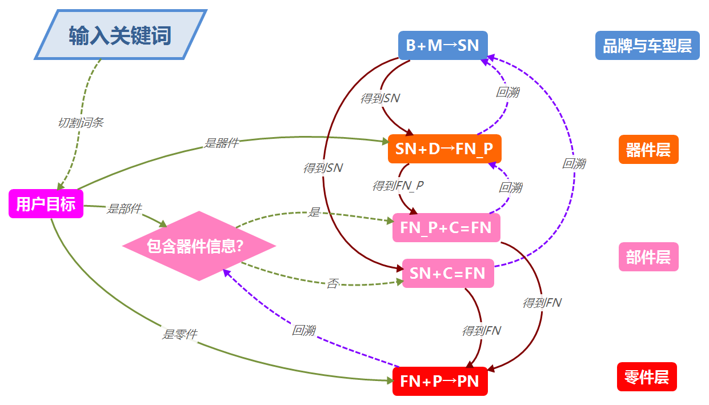

之前得到了$器件\rightarrow 部件\rightarrow 零件$的多层模型

| 用户关键词 | 厂家分类                 | 厂家索引        |
| ---------- | ------------------------ | --------------- |
| B+M+D      | 品牌→车型→器件           | $SN→FN_P$       |
| B+M+C      | 品牌→车型→部件           | $SN→FN$         |
| B+M+D+C    | 品牌→车型→器件→部件      | $SN→FN_P→F$     |
| B+M+C+P    | 品牌→车型→部件→零件      | $SN→FN→PN$      |
| B+M+D+C+P  | 品牌→车型→器件→部件→零件 | $SN→FN_P→FN→PN$ |

进而采用回溯的思想来解决查找问题

然而，这样的方法对于计算机来说并不方便处理

计算机的问题有：

- 如何把用户关键词切割成品牌、车型、器件、部件、零件？（也许品牌和车型可以根据中英文的不同区分出来，而器件、部件、零件的区分则是模糊的）
- 如何确定零件中是否包含器件信息

为了解决计算机的不足，我们想到了以下处理方法：

1. **扁平化：**从$品牌与车型层\rightarrow 器件层\rightarrow 部件层\rightarrow 零件层$由上到下的多层关系转变为同一层次的平等关系
2. **模糊化：**不再区分器件、部件和零件，而是假设切割出的每一个词条中都有可能包含器件、部件和零件信息。
3. **矩阵化：**使用计算机最擅长处理的矩阵结构，而不是多层的树形结构

于是优化之后的计算步骤是：

1. 准备数据集

- number.xlsx记录不同系列号对应的图号和件号
- serial_number.xlsx记录系列号的具体型号名称
- figure_number.xlsx记录图号的具体的部件名称
- part_number.xlsx记录件号的具体零件名称

**number.xlsx**

| 序列号    | 图号       | 件号           |
| --------- | ---------- | -------------- |
| 8J00001   | A0000-0001 | KT1G934-0101-2 |
| 8J00001   | A0000-0001 | KT15521-9602-0 |
| 8J00001   | A0000-0001 | KT15521-9603-0 |
| DJB000001 | D0100-01A0 | 22H-04-11101   |
| DJB000001 | D0100-01A0 | 22H-04-11111   |
| DJB000001 | D0100-01A0 | 20Y-04-11161   |
| ...       | ...        | ...            |

**serial_number.xlsx**

| 型号        | 类型   | 系列号    |
| ----------- | ------ | --------- |
| PC56        | 车体   | 8J00001   |
| S4D87E-1-CH | 发动机 | DJB000001 |
| ...         | ...    | ...       |

**figure_number.xlsx**

| 部件             | 图号       |
| ---------------- | ---------- |
| 气缸体           | A0000-0001 |
| 气缸盖           | A0000-0003 |
| 燃油箱           | D0100-01A0 |
| 燃油管路         | D0100-02A0 |
| 主阀（附加零件） | H0120-05A0 |
| ...              | ...        |

**part_number.xlsx**

| 零件       | 件号           |
| ---------- | -------------- |
| 气缸体总成 | KT1G934-0101-2 |
| 螺塞       | KT15521-9602-0 |
| 螺栓       | KT15321-2516-3 |
| 壳体       | KT1G850-0461-3 |
| 油箱总成   | 22H-04-11101   |
| ...        | ...            |

2. 初始化匹配权重矩阵，每一行代表一个个案（零件），每一列代表一个变量（器件层匹配成功次数，部件层匹配成功次数，零件层匹配成功次数）

$$
\begin{bmatrix}
0&0&0\\
0&0&0\\
0&0&0\\
...&...&...\\
0&0&0\\
0&0&0\\
\end{bmatrix}
$$

3. 切割用户输入的关键词，存入词条库

4. 计算机遍历serial_number.xlsx,figure_number.xlsx,part_number.xlsx数据集，如果发现数据集中的词条与词条库是否匹配（这里的匹配算法是一种模糊算法，对于两个字符串，如果有任意一个词条同属于两个字符串，就认定匹配），如果匹配就存入对应的序列号、图号和件号词典中并记录匹配成功的次数

5. 计算机遍历number.xlsx数据集，数据集的每一行代表一个零件，如果零件的序列号、图号、件号包含在对应的词典中，就为对应行加上该序列号匹配成功的次数

   

例如，用户输入的信息是**PC56气缸体总成**

1. 通过计算机自动切割，信息被分成PC56、气缸、体、总成

2. 通过词频-反文档频率法为每个词条赋权

3. 遍历serial_number数据集，发现PC56对应序列号8J0001；

   把8J0001加入序列号词典，计数**1*“PC56”权重**次

4. 遍历figure_number数据集，发现“气缸”对应图号A0000-0001、A0000-0003，“体”对应图号A0000-0001；

   把A0000-0001加入图号词典，计数**2*“气缸”权重**次，A0000-0003加入图号词典，计数**1*“体”权重**次

5. 遍历part_number数据集，发现“气缸””体“”总成“都对应件号KT1G934-0101-2，”体“对应件号KT1G850-0461-3，”总成“对应件号22H-04-11101；

   把KT1G934-0101-2加入件号词典，计数**3*“气缸”权重**次，KT1G850-0461-3加入件号词典，计数**1*"体"权重**次，22H-04-11101加入件号词典，计数**1*“总成”权重**次

最终得到的词典：

序列号词典

| 序列号 | 次数 |
| ------ | ---- |
| 8J0001 | 1    |

图号词典

| 图号       | 次数 |
| ---------- | ---- |
| A0000-0001 | 2    |
| A0000-0003 | 1    |

件号词典

| 件号           | 次数 |
| -------------- | ---- |
| KT1G934-0101-2 | 3    |
| KT1G850-0461-3 | 1    |
| 22H-04-11101   | 1    |

5. 遍历number数据集，每一行代表一个个案（零件），如果个案对应的序列号、图号、件号出现在对应词典中，就在对应行加上次数。

   遍历第1个零件：8J00001  A0000-0001  KT1G934-0101-2 

   得到次数向量$[1,2,3]$，赋给矩阵第1行

   遍历第2个零件：8J00001  A0000-0001  KT15521-9602-0 

   得到次数向量$[1,2,0]$，赋给矩阵第2行

   遍历第3个零件：8J00001  A0000-0001  KT15521-9603-0

   得到次数向量$[1,2,0]$，赋给矩阵第3行

   ...

6. 最终得到匹配权重矩阵

$$
\begin{bmatrix}
1& 2& 0\\
1& 2& 0\\
1& 2& 0\\
1& 2& 0\\
1& 0& 1\\
1& 0& 0\\
...&...&...\\
1& 0& 0\\
1& 0& 0\\
1& 0& 0\\
1& 0& 0\\
1& 0& 0\\
1& 0& 0\\
1& 0& 0\\
\end{bmatrix}
$$

### 数学表示

| 变量     | 含义         |
| -------- | ------------ |
| $W_A$    | 词条A的权重  |
| $S_{SN}$ | 序列号数据集 |
| $S_{FN}$ | 图号数据集   |
| $S_{PN}$ | 件号数据集   |
| $S$      | 总数据集     |
| $M_W$    | 匹配权重矩阵 |
| $S_I$    | 用户词条库   |
| $D_{SN}$ | 序列号词典   |
| $D_{FN}$ | 图号词典     |
| $D_{PN}$ | 件号词典     |

1. 切割用户输入关键词，存入词条库

   $I\rightarrow S_I$

2. 初始化匹配权重矩阵

   $\forall i,j, 1\le i\le|S|,1\le j\le 3,i,j\in R^*,M_{W_{ij}}=0$

3. 匹配序列号数据集，存入序列号词典并赋权

   $\forall sn_i \in S_{SN},sn_i\cap S_I\cdot W_{sn_i}=D_{sn_i}$

4. 匹配图号数据集，存入图号词典并赋权

   $\forall fn_i \in S_{FN},fn_i\cap S_I\cdot W_{fn_i}=D_{fn_i}$

5. 匹配件号数据集，存入件号词典并赋权

   $\forall pn_i \in S_{PN},pn_i\cap S_I\cdot W_{pn_i}=D_{pn_i}$
   
6. 遍历总数据集，比对序列号、图号、件号词典，为匹配权重矩阵赋权

   $\forall s_i\in S,s_i\cap |D_{SN}|=M_{W_{i1}},s_i\cap |D_{FN}|=M_{W_{i2}},s_i\cap |D_{PN}|=M_{W_{i3}}$

##### 流程图

