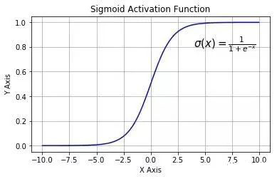

思考一个问题，如果用户是PC56型挖掘机的使用者，那么他搜索挖掘机的部件时，绝大多数情况应该都是在寻找PC56型挖掘机的零部件。

如果每次都让用户输入PC56来查找，显然是很麻烦的。

于是，我们可以把用户输入的高频词记录下来，存到数据中并统计出现次数（此处使用字典来模拟数据库），那么，当用户再次搜索时，即便不输入车型，我们也可以通过查询词库，推测他想买的零部件的车型。

python代码，用while循环模拟用户多次搜索的情况，输入“0”退出循环。

```python
import jieba

pattern_dic = {}
i = 1
while True:
    print('模拟用户第%d次搜索' % i)
    string = input('Enter your key word: ')
    if string == "0":
        break
    patterns = jieba.lcut_for_search(string)
    for pattern in patterns:
        if pattern not in pattern_dic:
            pattern_dic[pattern] = 1
        else:
            pattern_dic[pattern] += 1
    print(pattern_dic)
    i += 1
```


```shell
模拟用户第1次搜索
Enter your key word: PC56气缸体总成
{'PC56': 1, '气缸': 1, '体': 1, '总成': 1}
模拟用户第2次搜索
Enter your key word: PC56飞轮总成
{'PC56': 2, '气缸': 1, '体': 1, '总成': 2, '飞轮': 1}
模拟用户第3次搜索
Enter your key word: 飞轮螺栓
{'PC56': 2, '气缸': 1, '体': 1, '总成': 2, '飞轮': 2, '螺栓': 1}
模拟用户第4次搜索
Enter your key word: PC56软管支座
{'PC56': 3, '气缸': 1, '体': 1, '总成': 2, '飞轮': 2, '螺栓': 1, '软管': 1, '支座': 1}
模拟用户第5次搜索
Enter your key word: PC58壳体
{'PC56': 3, '气缸': 1, '体': 1, '总成': 2, '飞轮': 2, '螺栓': 1, '软管': 1, '支座': 1, 'PC58': 1, '壳体': 1}
模拟用户第6次搜索
Enter your key word: PC56气缸体膨胀塞
{'PC56': 4, '气缸': 2, '体': 1, '总成': 2, '飞轮': 2, '螺栓': 1, '软管': 1, '支座': 1, 'PC58': 1, '壳体': 1, '膨胀': 1, '体膨胀': 1, '塞': 1}
模拟用户第7次搜索
Enter your key word: PC56气缸体螺栓
{'PC56': 5, '气缸': 3, '体': 2, '总成': 2, '飞轮': 2, '螺栓': 2, '软管': 1, '支座': 1, 'PC58': 1, '壳体': 1, '膨胀': 1, '体膨胀': 1, '塞': 1}
模拟用户第8次搜索
Enter your key word: 气缸帽膨胀塞
{'PC56': 5, '气缸': 4, '体': 2, '总成': 2, '飞轮': 2, '螺栓': 2, '塞': 1, '软管': 1, '支座': 1, 'PC58': 1, '壳体': 1, '膨胀': 2, '体膨胀': 1, '帽': 1}
模拟用户第9次搜索
Enter your key word: 软管弯头
{'PC56': 5, '气缸': 4, '体': 2, '总成': 2, '飞轮': 2, '螺栓': 2, '软管': 2, '支座': 1, 'PC58': 1, '壳体': 1, '膨胀': 2, '体膨胀': 1, '赛': 1, '帽': 1, '塞': 1, '弯头': 1}
模拟用户第10次搜索
Enter your key word: 0

Process finished with exit code 0
```

经过10次模拟搜索，就可以发现用户钟情于PC56型号的挖掘机，而且经常浏览和气缸有关的零部件。

接下来要做的，就是根据用户词条为矩阵赋权。

```shell
Enter key word to search: PC56气缸体总成
[[1. 2. 3.]
 [1. 2. 0.]
 [1. 2. 0.]
 [1. 2. 0.]
 [1. 0. 1.]
 [1. 0. 0.]
 ...
 [1. 0. 0.]
 [1. 0. 0.]
 [1. 0. 0.]
 [1. 0. 0.]]

Process finished with exit code 0
```

观察原先的词频矩阵，里面记录着每个零件的匹配程度。

我们要做的就是给每个零件再匹配一次

python代码，修改用户的搜索词条，用字典存储，便于赋权。

```python
key_string = input("Enter key word to search: ")
patterns = jieba.lcut_for_search(key_string)
pattern_dic = {}
for pattern in patterns:
    if pattern not in pattern_dic:
        pattern_dic[pattern] = 1
    else:
        pattern_dic[pattern] += 1
```

把模拟历史词条加入用户搜索词条中。

```python
history_dic = {'PC56': 5, '气缸': 4, '体': 2, '总成': 2, '飞轮': 2, '螺栓': 2, '软管': 2, '支座': 1, 'PC58': 1, '壳体': 1, '膨胀': 2, '体膨胀': 1, '赛': 1, '帽': 1, '塞': 1, '弯头': 1}

for key in history_dic.keys():
    if key not in pattern_dic:
        pattern_dic[key] = history_dic[key]
    else:
        pattern_dic[key] += history_dic[key]
```


修改模糊匹配函数，统计词条权重。

```python
def fuzzy_matching_in_dic(word, dic):
    count = 0
    for each in dic:
        if fuzzy_matching(word, each):
            count += dic[each]
    return count
```

输出：

```shell
Enter key word to search: 
[[ 6.  8. 10.]
 [ 6.  8.  3.]
 [ 6.  8.  3.]
 [ 6.  8.  4.]
 [ 6.  0.  4.]
 [ 6.  0.  0.]
 [ 6.  0.  2.]
 [ 6.  0.  4.]
 [ 6.  0.  2.]
 [ 6.  0.  0.]
 [ 6.  0.  1.]
 [ 6.  0.  0.]
 [ 6.  2.  4.]
 [ 6.  2.  1.]
 [ 6.  2.  2.]
 [ 6.  2.  0.]
 [ 6.  0.  3.]
 [ 6.  0.  0.]
 [ 6.  0.  1.]
 [ 6.  0.  0.]]

Process finished with exit code 0
```

历史词条被考虑在内，但是这样的线性关系，历史词条的影响实在是太大了！当前用户的搜索记录几乎无法发挥作用，而且可以想象，如果历史搜索增加到几百次，我们将根本无法搜索到自己想要的结果，而是根据历史词条得到的固定结果。

因此，我们决定采用sigmoid函数来约束历史词条的权重。
$$
sigmoid:\sigma(z)=\frac{1}{1+e^{-z}}
$$
函数图像：



sigmoid函数可以很好的把最大值约束在一个范围内，我们对sigmoid函数稍加拉伸，使其适应更大的历史词条数：

```python
def sigmoid(x):
    return 0.1 / (1 + np.exp(-x / 10000))
```

输出：

```shell
Enter key word to search: 
[[0.100015  0.20002   0.250025 ]
 [0.100015  0.20002   0.1000075]
 [0.100015  0.20002   0.1000075]
 [0.100015  0.20002   0.15001  ]
 [0.100015  0.        0.10001  ]
 [0.100015  0.        0.       ]
 [0.100015  0.        0.050005 ]
 ...
 [0.100015  0.050005  0.050005 ]
 [0.100015  0.050005  0.       ]
 [0.100015  0.        0.1000075]
 [0.100015  0.        0.       ]
 [0.100015  0.        0.0500025]
 [0.100015  0.        0.       ]]

Process finished with exit code 0
```

历史词条的影响被框定在了一个比较合理的范围内，可以看到，在用户不添加任何关键词的情况下，历史记录有权重但也十分有限。

接下来仍然是进行层次分析与topsis处理，输出：

```shell
Matrix: 
[[0.100015  0.20002   0.250025 ]
 [0.100015  0.20002   0.1000075]
 [0.100015  0.20002   0.1000075]
 [0.100015  0.20002   0.15001  ]
 [0.100015  0.        0.10001  ]
 ...
 [0.100015  0.050005  0.050005 ]
 [0.100015  0.050005  0.       ]
 [0.100015  0.        0.1000075]
 [0.100015  0.        0.       ]
 [0.100015  0.        0.0500025]
 [0.100015  0.        0.       ]]
Number of objects: 20
Number of tags: 3
--*-- Positive Trend --*--
Enter col of tag if need positive trend. Enter nothing to exit
Col of tag: 
--*-- Result --*--
Score: 
    0.1937
    0.1650
    0.1650
    0.1737
    0.0200
         0
    0.0104
    0.0287
    0.0104
         0
    0.0104
         0
    0.0511
    0.0477
    0.0477
    0.0459
    0.0200
         0
    0.0104
         0
```

可以看到，仅通过历史词条，第一个零件的匹配得分略高于其他零件。

观察历史词条前4个子词：'PC56': 5, '气缸': 4, '体': 2, '总成': 2

观察第一个零件：**PC56-气缸体-气缸体总成**，完全符合词条，因此得分最高。

